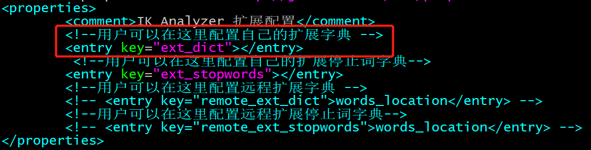

# Elasticsearch

- Elasticsearch是实时的分布式搜索引擎。用于全文检索、结构化搜索、分析。

- 可以认为ES是面向文档的，一切都是JSON

- 倒排索引机制

- 核心概念
    - Index(类似于数据库)
        - 在ES中，Index被分为多个分片(shard)，每个分片是一个Lucene的索引，故一个ES索引是由多个Lucene索引组成的
        - 创建index时，默认5个分片（primary shard, 主分片），1个副本（replica shard, 复制分片）
    - Type(类似于表，慢慢会被弃用)
    - Document(类似于行)
    - Field(字段)
    - Mapping(映射-约束, 数据如何存放到索引对象上，需要有一个映射配置，包括：数据类型、是否存储、是否分词等)

- IK中文分词器
    - 扩展ik词库：
        1. 修改/usr/local/elasticsearch/plugins/ik/config/main.dic
        1. 然后分发到每台ES服务器的/usr/local/elasticsearch/plugins/ik/config/目录下
        1. 重启ES之后IK分词器才会重新加载main.dic文件，新添加的词才会生效
        1. 只有在IK分词器重新加载main.dic之后插入的数据才会分出新的词，
        同样查询的时候也是在IK分词器重新加载之后，才能使用新的词进行分词查询
    - 创建自己的词库,重启后加载
        
        
- SQL查询

- Dynamic Mapping
    - true : 将新识别的字段加入mapping (默认选项)
    - false: 新识别的字段被忽略，不会被添加到mapping中，新字段必须被显式的添加到mapping中。 这些字段不会被索引也不能被搜索，但是仍然会出现在_source字段中。
    - strict: 有新字段时会抛出异常，拒绝文档写入。新字段必须显式的添加到mapping中。
    - [Elasticsearch dynamic mapping策略](https://blog.csdn.net/zx711166/article/details/82427837)