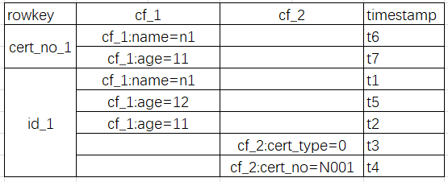
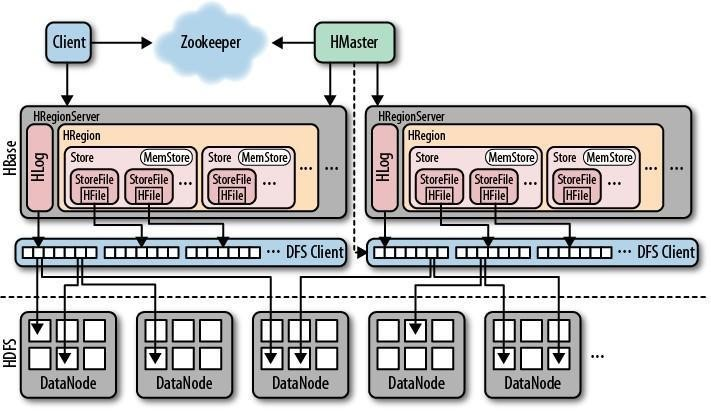
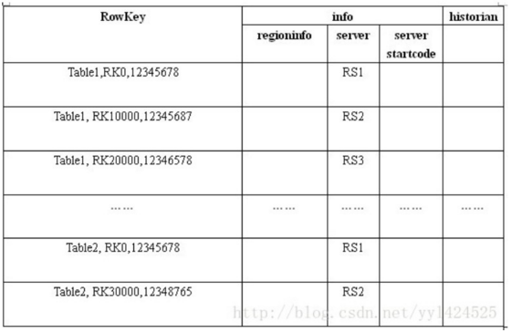
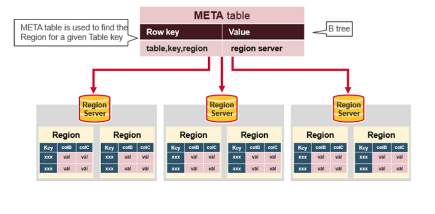
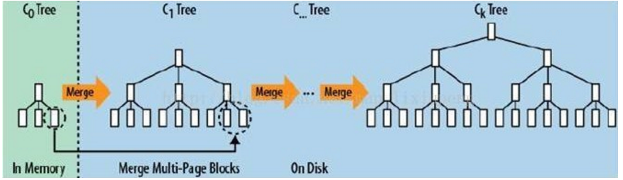

# HBase
- 简介
    - Apache HBase™ is the Hadoop database, a distributed, scalable, big data store.
    - HBase是一个分布式的、可扩展的大数据存储Hadoop数据库。
    
- 数据单元
    - row key：确定唯一的一行
    - column family：由若干column组成
    - column：表的字段
    - cell：存储了实际的值或数据
    - (Version Number：类型为Long，默认值是系统时间戳Timestamp，可由用户自定义;用于标记同一份数据的不同版本)
    - 
    
- 架构组成
    - HBase采用Master/Slave架构搭建集群，它隶属于Hadoop生态系统，由以下类型节点组成：HMaster节点、HRegionServer节点、ZooKeeper集群，而在底层，它将数据存储于HDFS中，因而涉及到HDFS的NameNode、DataNode等，总体结构如下：
    - 
    - Client
        - 使用HBase RPC机制与HMaster和HRegionServer进行通信；
        - Client与HMaster进行通信,进行管理类操作；
        - Client与HRegionServer进行通信,进行数据读写类操作；
    - HMaster: HMaster没有单点问题，HBase中可以启动多个HMaster，通过ZK保证总有一个Master在运行。HMaster主要负责Table和Region的管理工作：
        - 管理用户对表的增删改查操作
        - 管理HRegionServer的负载均衡，调整Region分布
        - Region Split后，负责新Region的分布
        - 在HRegionServer停机后，负责失效HRegionServer上Region的迁移
    - HRegionServer：HBase中最核心的模块,包含：Write-Ahead logs，HFile，Store，MemStore，Region
        - 维护region，处理对这些region的IO请求
        - RegionServer负责切分在运行过程中变得过大的region
    - Zookeeper
        - ZooKeeper为HBase集群提供协调服务，它管理着HMaster和HRegionServer的状态(available/alive等)
            - 保证集群中只有一个HMaster，会在它们宕机时通知给HMaster，从而HMaster可以实现HMaster之间的故障转移
            - 实时监控HRegionServer的上线和下线信息，并实时通知给HMaster
        - 存储HBase的Meta Table(hbase:meta)的位置，Meta Table表存储了集群中所有用户HRegion的位置信息，且不能split

- HRegionServer组成
    - Write-Ahead logs：
        - HBase的修改记录，当对HBase读写数据的时候，数据不是直接写进磁盘，它会在内存中保留一段时间（时间以及数据量阈值可以设定）。
        - 如果宕机，把数据保存在内存中会引起数据丢失，为了解决这个问题，数据会先写在一个叫做Write-Ahead logfile的文件中，然后再写入内存中。
    - HFile：这是在磁盘上保存原始数据的实际的物理文件，是实际的存储文件。
    - Store：HFile存储在Store中，一个Store对应HBase表中的一个列族
    - MemStore：写缓存。它存储尚未写入磁盘的新数据，并会在数据写入磁盘之前对其进行排序。每个Region上的每个列族都有一个MemStore。
    - BlockCache：读缓存。它将频繁读取的数据存储在内存中，如果存储不足，它将按照 最近**最少使用原则**清除多余的数据。
    - Region：Hbase表的分片，HBase表会根据RowKey值被切分成不同的region存储在RegionServer中，在一个RegionServer中可以有多个不同的region
    - 
    
- Meta Table
    - hbase:meta表中，保存了每个表的region地址，还有一些其他信息，例如region的名字，HRegionInfo,服务器的信息。
    - hbase:meta表中每一行对应一个单一的region。
    - hbase:meta表的rowKey:([table],[region start key],[region id])
        - 第二分隔符前存的是region的第一个rowKey，这里两个需要注意:
            1. 如果这个地方为空的话，表明这是table的第一个region。并且如果一个region中startkey和endkey都为空的为，表明这个table只有一个region。
            2. 在mata表中，startkey 靠前的region会排在startkey 靠后的region前面。（Hbase中的keys是按照字段顺序来排序的）
        - region id就是region的id,通常来说就是region创建的时候的timestamp
    - regioninfo 是HRegionInfo的序列化值。
    - server是指服务器的地址和端口
    - serverstartcode 是服务开始的时候的timestamp
    - 

- HBase读数据流程
    1. 客户端在本地缓存读取hbase:meta表的所在的位置，即对应的RegionServer位置信息
    1. 如果在缓存中获取不到hbase:meta表所在的位置信息，去zk中获取hbase:meta表的所在的位置信息，并缓存其对应的RegionServer位置信息
    1. 在hbase:meta表查找，获取存放目标数据的Region信息，从而找到对应的RegionServer。 
    1. 根据读取的TableName和RowKey的startkey 、endkey 找到对应的HRegion
    1. 每个regionserver只有一个blockcache（读缓存），读取数据时，先到memestore上读数据，找不到再到blockcahce上找数据，再查不到则到磁盘（storefile）查找，并把读入的数据同时放入blockcache。
    - 
    
- HBase写数据流程
    1. 通过读取数据流程1~3找到该写数据最终需要去的HRegionServer；
    1. Write Ahead Log（WAL）：然后客户端将写请求发送给相应的HRegionServer，在HRegionServer中它首先会将该写操作写入Hlog日志文件中(Flush到磁盘中)。
    1. 写完Hlog日志文件后，HRegionServer根据Put中的TableName和RowKey、startkey、endkey找到对应的HRegion，并根据Column Family找到对应的HStore，并将Put写入到该HStore的MemStore中。如果HLog和Memstore均写入成功，则这条数据写入成功，并返回通知客户端。
    1. 写入MemStore后的操作：
        1. 存入MemStore，一直到MemStore满
        1. Flush成一个StoreFile，直至增长到一定阈值
        1. 触发Compact合并操作 -> 多个StoreFile合并成一个StoreFile，同时进行版本合并和数据删除
        1. 当StoreFiles Compact后，逐步形成越来越大的StoreFile
        1. 单个StoreFile大小超过一定阈值（Region split 阈值）后，触发Split操作，把当前Region Split成2个Region，Region会下线，新Split出的2个子Region会被HMaster分配到相应的HRegionServer上，使得原先1个Region的压力得以分流到2个Region上；

- MemStore Flush机制
    - Region级别的flush
        - 当一个MemStore的大小超过了hbase.hregion.memstore.flush.size(128M)的大小，此时当前的HRegion中所有的MemStore会Flush到HDFS中，不阻塞写操作。
        - 当一个Region的MemStore总量达到hbase.hregion.memstore.block.multiplier * hbase.hregion.memstore.flush.size(默认2*128M=256M)时，会阻塞这个region的写操作，并强制刷写到HDFS。触发这个刷新只会发生在MemStore即将写满128M时put了一个巨大的记录的情况，这时会阻塞写操作，强制刷新成功才能继续写入
    - HRegionServer级别的flush
        - 当RS里所有的MemStore的大小超过了hbase.regionserver.global.memstore.upperLimit(默认0.4，memstores所占最大堆空间比例)的大小，此时当前HRegionServer中所有HRegion中的MemStore都会Flush到HDFS中，阻塞写操作。
        - 当前HRegionServer中HLog的大小超过阈值，当前HRegionServer中所有HRegion中的MemStore都会Flush到HDFS中。（RS级别的flush）

- Region Split机制
    - HRegionServer拆分region步骤
        - 先将该region下线，然后拆分
        - 将其子region加入到hbase:meta表中
        - 再将他们加入到原本的HRegionServer中
        - 最后汇报Master。
    - 拆分策略(hbase.regionserver.region.split.policy)
        - SteppingSplitPolicy现在默认的策略
        - IncreasingToUpperBoundRegionSplitPolicy(以前默认的策略)
        - ConstantSizeRegionSplitPolicy：仅仅当region大小超过常量值（hbase.hregion.max.filesize大小）时，才进行拆分。
        - DelimitedKeyPrefixRegionSplitPolicy
        - KeyPrefixRegionSplitPolicy：保证以分隔符前面的前缀为splitPoint，保证相同RowKey前缀的数据在一个Region中。
        - KeyPrefixRegionSplitPolicy：保证具有相同前缀的row在一个region中（要求设计中前缀具有同样长度）

- HBase数据结构LSM树(Log-Structured Merge-Trees)
    - 将对数据的修改增量保持在内存中，达到指定的大小限制后将这些修改操作批量写入磁盘
    - 不过读取的时候稍微麻烦，需要合并磁盘中历史数据和内存中最近修改操作，所以写入性能大大提升，读取时可能需要先看是否命中内存，否则需要访问较多的磁盘文件。
    - 极端的说，基于LSM树实现的HBase的写性能比MySQL高了一个数量级，读性能低了一个数量级。
    - 基本过程
        - LSM树原理把一棵大树拆分成N棵小树，它首先写入内存中
        - 随着小树越来越大，内存中的小树会flush到磁盘中
        - 磁盘中的树定期可以做merge操作，合并成一棵大树，以优化读性能。
    - 

- RowKey设计原则
    - 要保证rowkey的唯一性
    - rowkey 长度建议是越短越好，不要超过16个字节
    - Rowkey的散列原则
        - 如果Rowkey是按时间戳的方式递增，不要将时间放在二进制码的前面，建议将散列字段作为Rowkey的高位，由程序循环生成，低位放时间字段，这样将提高数据均衡分布在每个Regionserver实现负载均衡的几率。
        - 如果没有散列字段，首字段直接是时间信息将产生所有新数据都在一个RegionServer上堆积的热点现象，这样在做数据检索的时候负载将会集中在个别RegionServer，降低查询效率。
    - 常用方法
        - 生成随机数、hash、散列值(原本rowKey为1001的，MD5后变成：b8c37e33defde51cf91e1e03e51657da)
        - 字符串反转(20170524000001转成10000042507102)
        - 字符串拼接(20170524000001_a12e)

- HBase shell commands
    - [HBase shell commands](commands.md)

- Hive与HBase的对比

- 参考
    1. [Apache HBase官方文档](http://hbase.apache.org/book.html#regionserver.arch)