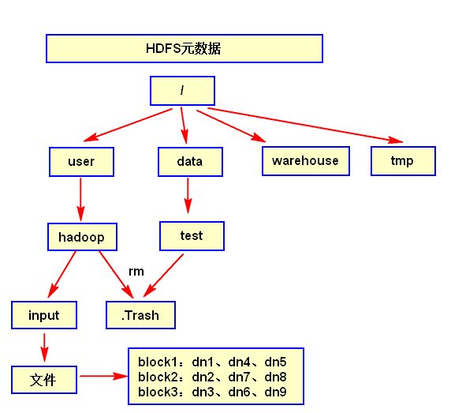

# HDFS
1. HDFS是一种**分布式**的**文件系统**，适合“一次写入，多次读取”
1. hadoop 2.x block大小默认128Mb，1.x是64Mb。HDFS的块比磁盘的块大，其目的是为了最小化寻址开销
    - block太大，不适宜计算；太小，占namenode内存(一个block所占用的namenode内存存储空间为一般为150字节)
1. HDFS元数据
    - 主要包括整个文件系统的目录树、文件名与blockid的映射关系、blockid在哪个datanode上
    - 
1. HDFS写数据流程
    1. 客户端向namenode请求上传文件，namenode检查目标文件是否已存在，父目录是否存在。
    2. namenode返回是否可以上传。
    3. 客户端请求第一个 block上传到哪几个datanode服务器上。
    4. namenode返回3个datanode节点，分别为dn1、dn2、dn3。
    5. 客户端请求dn1上传数据，dn1收到请求会继续调用dn2，然后dn2调用dn3，将这个通信管道建立完成。
    6. dn1、dn2、dn3逐级应答客户端
    7. 客户端开始往dn1上传第一个block（先从磁盘读取数据放到一个本地内存缓存），以packet为单位，dn1收到一个packet就会传给dn2，dn2传给dn3；dn1每传一个packet会放入一个应答队列等待应答
    8. 当一个block传输完成之后，客户端再次请求namenode上传第二个block的服务器。（重复执行3-7步）
1. 网络拓扑
    - 节点：我的理解就是CPU+硬盘组装的基本运算单元，很多节点组成一个机架
    - 节点距离：两个节点到达最近的共同祖先的距离总和。
    - 假设有数据中心d1机架r1中的节点n1。该节点可以表示为/d1/r1/n1。
1. Hadoop2.7.2机架感知策略（副本节点选择）
    - 第一个副本在client所处的节点上。如果客户端在集群外，随机选一个。
    - 第二个副本和第一个副本位于相同机架，随机节点。
    - 第三个副本位于不同机架，随机节点。
1. HDFS读数据流程（这里的读就是读取，下载）
    - 客户端向namenode请求下载文件，namenode通过查询元数据，找到文件块所在的datanode地址。
    - 挑选一台datanode（就近原则，然后随机）服务器，请求读取数据。
    - datanode开始传输数据给客户端（从磁盘里面读取数据放入流，以packet为单位来做校验）。
    - 客户端以packet为单位接收，先在本地缓存，然后写入目标文件。
1. RPC（Remote Procedure Call Protocol）
   - 远程过程调用协议。一个通俗的描述是：客户端在不知道调用细节的情况下，调用存在于远程计算机上的某个对象，就像调用本地应用程序中的对象一样。
   - 目前，主流的平台中都支持各种远程调用技术，以满足分布式系统架构中不同的系统之间的远程通信和相互调用。
1. NameNode & Secondary NameNode工作机制
    - Secondary NameNode的目的是在HDFS中提供一个NameNode检查点。[Secondary NameNode:它究竟有什么作用？](https://blog.csdn.net/jenrey/article/details/80738389)
1. HDFS HA（两个NameNode, Journalnode, ZKFC）
    - **不需要**在HA集群中运行SecondaryNameNode、CheckpointNode或者BackupNode
    - NameNode Active 和 NameNode StandBy
        1. 两个NameNode各自保存一份元数据
        2. 因为NameNode启动中最费时的工作是处理所有DataNode的block report, 为了快速的切换NN,DataNodes上需要同时配置两个Namenode的地址，同时和它们都建立心跳链接，并把block位置发送给它们。
    - JournalNode存储、管理两个NameNode共享的edits, 通常也是奇数个
        1. Edits日志只有Active状态的namenode节点可以做写操作
        2. 一条数据只要成功写入多数JournalNode即认为写入成功
        3. 两个namenode都可以读取edits
    - ZKFC是一个Zookeeper的客户端, 它主要用来监测和管理NameNodes的状态，**每个**NameNode机器上都会运行一个ZKFC程序
        1. 健康监控。间歇性的ping NameNode，得到NameNode健康状态
        2. Zookeeper会话管理。当本地NaneNode健康，ZKFC将会持有一个Zookeeper session，如果本地NameNode为Active，它同时也持有一个“排他锁”znode。如果session过期，那么次lock所对应的znode也将被删除
        3. 选举。当集群中其中一个NameNode宕机，Zookeeper会自动将另一个激活。
1. [Hadoop的SecondaryNameNode和HA（高可用）区别](https://blog.csdn.net/andyguan01_2/article/details/88696239?utm_medium=distribute.pc_relevant_t0.none-task-blog-BlogCommendFromMachineLearnPai2-1.nonecase&depth_1-utm_source=distribute.pc_relevant_t0.none-task-blog-BlogCommendFromMachineLearnPai2-1.nonecase)
1. DataNode 工作机制
    - datanode之间可以相互传输数据
    - 一个数据块在datanode上以文件形式存储在磁盘上，包括两个文件：
        - 一个是数据本身
        - 一个是元数据包括数据块的**长度**，**块数据的校验和**(checksum，验证数据完整性)，**时间戳**。
    - DataNode启动后向namenode注册，通过后，周期性（1小时）的向namenode上报所有的块信息。
    - 心跳是每3秒一次，心跳返回结果带有namenode给该datanode的命令如复制块数据到另一台机器，或删除某个数据块。如果超过10分钟没有收到某个datanode的心跳，则认为该节点不可用。
    - 集群运行中可以安全加入和退出一些机器
