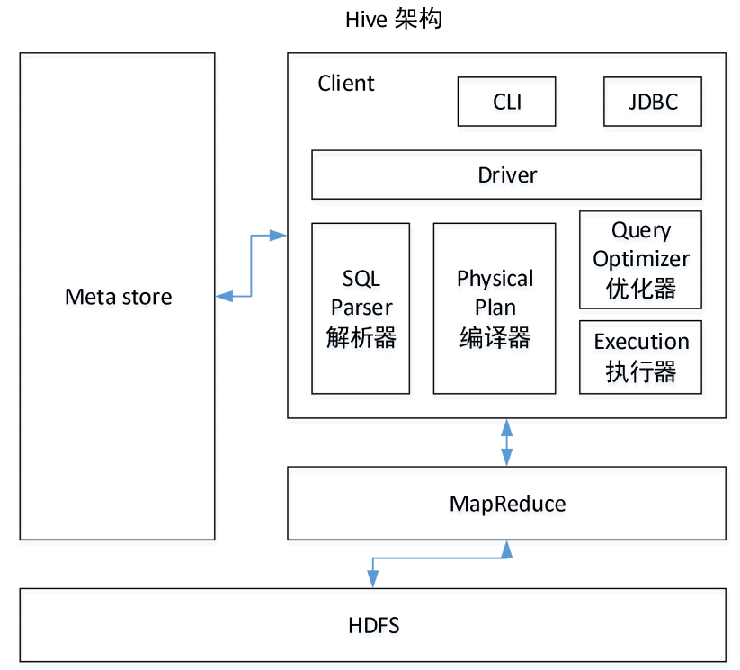
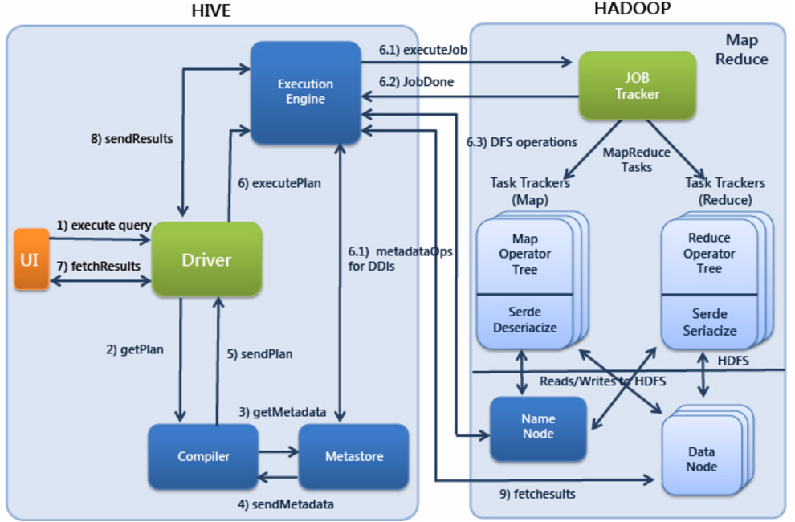

# Hive
1. Hive是基于Hadoop的一个数据仓库工具，可以将结构化的数据文件映射为一张表，并提供类SQL查询功能。
1. 可以认为Hive是一个封装了hadoop功能的**客户端**（存储是hdfs，计算是MR/Spark，资源调度是Yarn）,从而更简单的使用hadoop做数据处理
1. 优点
    - 操作接口采用类SQL语法，避免了去写MapReduce，减少开发人员的学习成本，提供快速开发的能力（简单、容易上手）
    - Hive 支持用户自定义函数，用户可以根据自己的需求来实现自己的函数
    - 处理大规模数据、实时性要求较低的数据
1. 缺点
    - HQL表达能力有限（迭代式算法无法表达，不擅长数据挖掘）
    - Hive的效率比较低（Hive 调优比较困难，粒度较粗）
1. 架构
    1. 用户接口：Client：CLI（hive shell）、JDBC/ODBC(java访问hive)、WEBUI（浏览器访问hive）
    1. 元数据：Metastore
        - 这个组件存取Hive的元数据，Hive的元数据存储在关系数据库里，Hive支持的关系数据库有Derby和Mysql,推荐使用MySQL存储Metastore
        - 作用：客户端连接metastore服务，metastore再去连接数据库(Derby/Mysql)来存取元数据。
        - 元数据包括：表名、表所属的数据库（默认是default）、表的拥有者、列/分区字段、表的类型（是否是外部表）、表的数据所在目录等
    1. hadoop: hdfs/yarn/MR/Spark
    1. 驱动器： Driver
        - 解析器（SQLParser）：将SQL字符串转换成抽象语法树AST，这一步一般都用第三方工具库完成，比如antlr；对AST进行语法分析，比如表是否存在、字段是否存在、SQL语义是否有误。
        - 编译器（PhysicalPlan）：将AST编译生成逻辑执行计划
        - 优化器（QueryOptimizer）：对逻辑执行计划进行优化
        - 执行器（Execution）：把逻辑执行计划转换成可以运行的物理计划。对于Hive来说，就是MR/Spark
    
        
1. Hive查询的执行过程
    1. Execute Query：hive界面如命令行或Web UI将查询发送到Driver(任何数据库驱动程序如JDBC、ODBC,等等)来执行。
    1. Get Plan:Driver根据查询编译器解析query语句,验证query语句的语法,查询计划或者查询条件。
    1. Get Metadata：编译器将元数据请求发送给Metastore(数据库)。
    1. Send Metadata：Metastore将元数据作为响应发送给编译器。
    1. Send Plan：编译器检查要求和重新发送Driver的计划。到这里,查询的解析和编译完成。
    1. Execute Plan:Driver将执行计划发送到执行引擎。
        1. Execute Job:hadoop内部执行的是mapreduce工作过程,任务执行引擎发送一个任务到资源管理节点(resourcemanager)，资源管理器分配该任务到任务节点，由任务节点上开始执行mapreduce任务。
        1. Metadata Ops：在执行引擎发送任务的同时,对hive的元数据进行相应操作。
    1. Fetch Result：执行引擎接收数据节点(data node)的结果。
    1. Send Results:执行引擎发送这些合成值到Driver。
    1. Send Results：Driver将结果发送到hive接口。
    

1. Hive与数据库的比较
    - 查询语言
    - 数据存储位置
    - 数据更新：数据仓库的内容是读多写少的，不建议对数据的改写；数据库的数据经常修改更新
    - 执行
    - 执行延迟
    - 可扩展性
    - 数据规模
    - (Hive从0.7.0版本开始加入了索引!!)索引：hive不建立索引，而由于MapReduce的引入，Hive可以并行访问数据，因此即使没有索引，对于大数据量的访问，Hive仍然可以体现出优势。

1. hive的三种模式
    - 使用内置的derby数据库做元数据的存储，操作derby数据库做元数据的管理
    - 本地模式:使用mysql做元数据的存储，操作mysql数据库做元数据的管理
    - 远程模式:使用mysql做元数据的存储，使用metastore服务做元数据的管理(企业推荐)

1. hive的数据组织
    - 数据库Databases ，表Tables ，分区 Partitions，桶 Buckets

1. 常用命令
    - [hive常用命令](commands.md)

1. 数据类型
    - 基本数据类型
    - 集合数据类型(ARRAY, MAP, STRUCT)
        - ARRAY和MAP与Java中的Array和Map类似
        - STRUCT与C语言中的Struct类似，STRUCT也类似于java的类变量使用，struct类型也可以使用点来访问(struct.field_name)
        ```
        create table test(
        name string,
        friends array<string>,
        children map<string, int>,
        address struct<street:string, city:string>
        ) 
        row format delimited fields terminated by ','
        collection items terminated by '_'
        map keys terminated by ':'
        lines terminated by '\n';
        ```
    - 日期与时间戳(timestamp, date)

1. 各种表
    - 临时表CREATE TEMPORARY：临时表是session内可见，将数据临时存在scratch目录，session退出后表和数据自动删除。(比如insert 一条数据)
    - 内部表与外部表
        - CREATE TABLE：内部表的特点是删除表时会同时删除表数据
        - CREATE EXTERNAL TABLE：创建表时指定数据HDFS目录，删除表时不会删除表数据
    - 分区表
        - 动态分区
        ```sql
        
        create table partition_sum(
        `aid` string COMMENT 'from deserializer', 
        `pkgname` string COMMENT 'from deserializer', 
        `uptime` bigint COMMENT 'from deserializer', 
        `country` string COMMENT 'from deserializer')
        PARTITIONED BY (gp string COMMENT 'from deserializer')
        ROW FORMAT DELIMITED FIELDS TERMINATED BY '\t';
        
        -- 开启动态分区
        set hive.exec.dynamic.partition=true;
        -- 这个属性默认是strict，即限制模式，strict是避免全分区字段是动态的，必须至少一个分区字段是指定有值即静态的且必须放在最前面。
        -- 设置为nonstrict之后所有的分区都可以是动态的了。
        set hive.exec.dynamic.partition.mode=nonstrict;
  
        --------------------------------备选----------------------------------------
        --表示每个节点生成动态分区的最大个数，默认是100
        set hive.exec.max.dynamic.partitions.pernode=10000;  
        
        --表示一个DML操作可以创建的最大动态分区数，默认是1000
        set hive.exec.max.dynamic.partitions=100000;
        
        --表示一个DML操作可以创建的最大文件数，默认是100000
        set hive.exec.max.created.files=150000
  
        
        insert overwrite table partition_sum partition(gp)
        select * from sum_app_run_limit;

        ```
    - AVRO表
        - 用json类型创建schema，将schema文件放到指定的hdfs目录上面
        ```
        CREATE EXTERNAL TABLE IF NOT EXISTS word_avro
        ROW FORMAT SERDE 'org.apache.hadoop.hive.serde2.avro.AvroSerDe'
        WITH SERDEPROPERTIES ('avro.schema.url'='/user/panniu/hive/config/schema.avsc')
        STORED AS INPUTFORMAT 'org.apache.hadoop.hive.ql.io.avro.AvroContainerInputFormat'
        OUTPUTFORMAT 'org.apache.hadoop.hive.ql.io.avro.AvroContainerOutputFormat'
        LOCATION '/user/panniu/hive/word_avro';
        ```
        - 可以通过修改schema文件新增字段
            - 如果新增字段，需要给新增字段设置默认值，否则查询会报错。
    - ORC(Optimized Row Columnar)表, 即优化了的RCFile
        - 优点是：1.在文件中存储了一些轻量级的索引数据。2.数据压缩。
        - orc表的散列字段查询，可以不执行mapreduce
        - orc文件小数据量不走mapreduce，大数据量也会走mapreduce。

    - Bucket（桶）表
        - hive桶表最大限度的保证了每个桶中的文件中的数据量大致相同，不会造成数据倾斜。
        - whichBucket = hash(columnValue) % numberOfBuckets
        - 桶表抽样
        ```sql
        -- 没num2个桶抽一个样，标号从num1开始
        select * from buckets_table tablesample(bucket num1 out of num2 on country)
        ```

1. 视图操作
    - 视图只能查询，不能Load/Insert/Update/Delete数据； alter view 和重建效果一致。
    - 图在创建时候，只是保存了一份元数据，在hdfs中没有体现，当查询视图的时候，才开始执行视图对应的那些子查询，如果子查询比较简单，不会生成MapReduce任务；
    - 视图列和类型可以不指定，如果不指定则有select集合列名和类型决定。

1. 数据加载
    - load加载数据
    ```sql
    --load数据加载语法格式
    LOAD DATA [LOCAL] INPATH 'filepath' [OVERWRITE] INTO TABLE tablename [PARTITION (partcol1=val1, partcol2=val2 ...)]
    ```
    - select加载
    ```sql
    --通过select，将select数据覆盖表或分区的语法格式
    INSERT OVERWRITE TABLE tablename1 [PARTITION (partcol1=val1, partcol2=val2 ...) [IF NOT EXISTS]] select_statement1 FROM from_statement;
    
    --通过select，将select数据追加到表或分区的语法格式
    INSERT INTO TABLE tablename1 [PARTITION (partcol1=val1, partcol2=val2 ...)] select_statement1 FROM from_statement;
    ```

1. 数据导出
    - 将数据写入一个文件
    ```sql
    --语法格式
    INSERT OVERWRITE [LOCAL] DIRECTORY directory1
      [ROW FORMAT row_format] [STORED AS file_format] 
      SELECT ... FROM ...
    ```
    - 将数据写入多个文件
    ```sql
    --语法格式
    FROM from_statement
    INSERT OVERWRITE [LOCAL] DIRECTORY directory1 row_format
    select_statement1 where 
    [INSERT OVERWRITE [LOCAL] DIRECTORY directory2 row_format
    select_statement2 where ] ...
    row_format
      : DELIMITED [FIELDS TERMINATED BY char [ESCAPED BY char]] [COLLECTION ITEMS TERMINATED BY char]
            [MAP KEYS TERMINATED BY char] [LINES TERMINATED BY char]
            [NULL DEFINED AS char]
     
    ```
        - 导出到文件系统的数据都序列化成text，非原始类型字段会序列化成json，导出文件以^A分隔 \n结尾的文本数据。
        - INSERT OVERWRITE 到HDFS目录，可以通过MR job实现并行写入。这样在集群上抽取数据不仅速度快，而且还很方便。
        - 批量导出多个文件，需要导出文件的类型一致，如果一个是avro，一个是text，报错。
    -  hive -e 命令 导出
    ```
    -- 导出数据
    hive -e "select word,num from  class11.ext_task where taskname='wordcount04' ;" > ./output_txt4
    hive -e "use class11;select word,num from  ext_task where taskname='wordcount04' ;" > ./output_txt4
    nohup hive -e "select word,num from  class11.ext_task where taskname='wordcount04' ;" 1> ./output_txt5 2>./err.log &
    nohup hive -e "select word,num from  class11.ext_task where taskname='wordcount04' ;" 1> ./output_txt6 2>/dev/null &
    ```

1. HQL语法
    - SELECT
    - JOIN
        - 写包含join操作的查询语句：将条目少的表/子查询放在join的左边，可以有效减少OOM的几率。原因是在join操作的reduce阶段，join左边的表会被加载进内存。
        - hive默认是开启MAPJOIN。手动设置的话：左连接右表放内存，右连接左表放内存，否则报错
    - GROUPING SETS
    - 选择
        - IF(条件表达式, true的结果, false的结果)
        - COALESCE( value1,value2,… ), 返回参数中的第一个非空值
        - case when
    - 排序
        - order by，会对输入做全局排序，因此只有一个reducer。
        - sort by，不是全局排序，其在数据进入reducer前完成排序。sort by只能保证单个文件内有序，如果设置成一个reducer那作用和order是一样的
        - distribute by,就是把相同的key分到一个reducer中,根据distribute by指定的字段对数据进行划分到不同的输出reduce文件中。即只分key，不排序
        - CLUSTER BY， cluster by column = distribute by column + sort by column
    
    - 要避免的查询操作
        1. 限制执行可能形成笛卡尔积的SQL；
        2. partition表使用时不加分区；
        3. order by全局排序的时候不加limit的情况；
    

1. 窗口函数

1. 自定义函数

1. hive的数据倾斜场景及处理方式