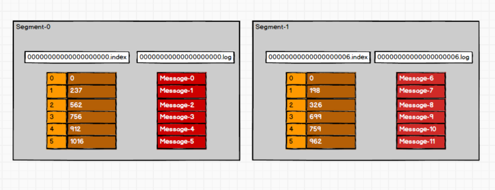
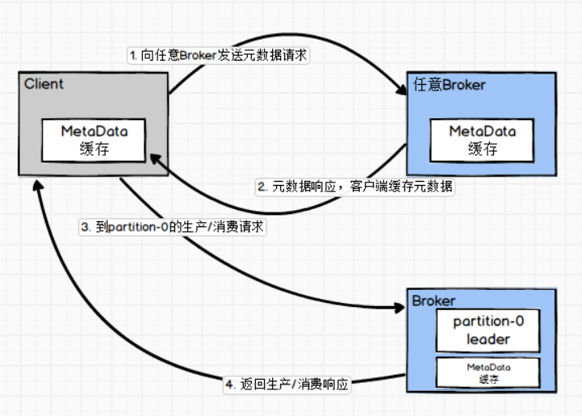
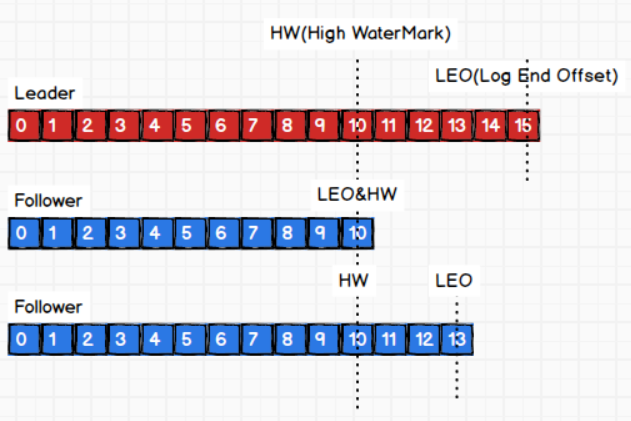
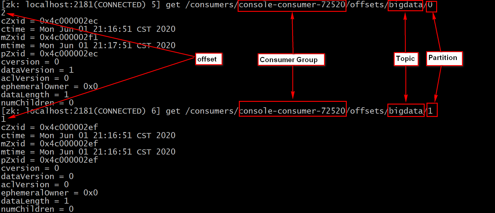
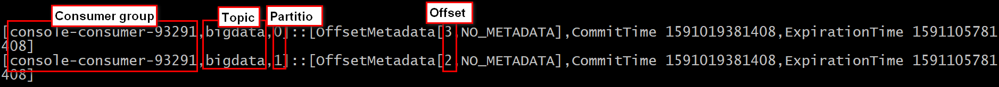
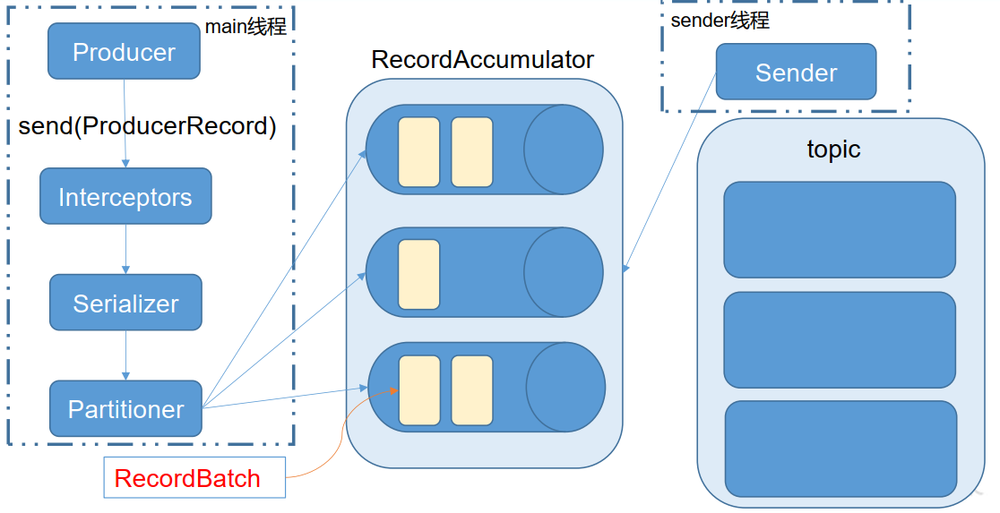

# Kafka

- Kafka是一个基于发布订阅模式的分布式消息队列, 主要应用于大数据实时处理领域。
([观察者和发布订阅模式的区别](https://www.cnblogs.com/viaiu/p/9939301.html))

- 消息队列的两种模式
    - 点对点模式（一对一，消费者主动拉取数据，消息收到后消息清除）
    - 发布/订阅模式（一对多）
        - 队列主动推送消息给消费者
        - 消费者主动向队列拉取消息（**Kafka**）
            - 缺点：需要一直轮询队列，查看是否有新消息

- Kafka架构
    - Broker ：一台kafka服务器就是一个broker。一个集群由多个broker组成。一个broker可以容纳多个topic
    - Producer ：消息生产者，就是向kafka broker发消息的客户端
    - Consumer ：消息消费者，向kafka broker取消息的客户端
    - Consumer Group：这是kafka用来实现一个topic消息的广播（发给所有的consumer）和单播（发给任意一个consumer）的手段
    - Topic ：可以理解为一个队列，消息根据topic来分类
    - Partition：一个topic可以分为多个partition，每个partition是一个有序的队列。提高读写并发，增加吞吐量。
        - 每个partition有leader和副本follower
            - 一个partition的所有副本（leader+follower）的数量应该小于等于broker的数量，否则报错
            - 所有的生产与消费请求必须发送给leader
            - follower的唯一任务就是复制leader的消息以及当leader下线被提升为新的leader
        - 由各个segment组成，超过一定大小(默认1G)或者时间，产生新的segment
            - 00000000000000000000.index存储每条消息的偏移量
            - 00000000000000000000.log存储数据
            - segment的名字对应了其中的消息最小偏移量
            
            - 比如定位Message-3, 如何通过index快速定位对应消息？
                1. 首先根据二分查找将offset定位到segment0
                1. 因为00000000000000000000.index是的key是连续的，并且size固定，所以可以快速定位到index=3
                1. index=3对应的value存储了Message-3的起始位置和大小，
                因此在00000000000000000000.log快速定位读取Message-3
    - Offset：消息消费的位置
        - 每个partition的offset从0开始算，但是consumer提交offset后，ZK或者Kafka本地保存的是实际partition的**offset+1**，即下一个消费的数据的offset
        - 0.9版本之前offset存在ZK
        - 0.9版本之后offset存在kafka集群本地的一个topic:__consumer_offsets-parNum

- Broker
    - 处理请求：元数据请求，生产请求，获取请求
    - 元数据: topic所含的分区，分区的副本，副本的leader等
    
    
- Producer
    1. 分区分配策略
        - 分区原因：1）方便在集群中扩展，2）提高并发
        - 数据发送分区的原则：
            1. 指定partition
            1. 指定key，将partition=key.hashCode%partition_num
            1. 未给定partition和key，第一次的partition=Random(Int)%partition_num,随后round-robin(轮询)
    1. 数据可靠性保证  
        为保证producer发送的数据能可靠的发送到指定的topic，topic的每个partition收到producer发送的数据后，
        都需要向producer发送ack（acknowledgement确认收到），若producer未收到ack，则重新发送这个批次的数据。
        - 何时返回ack?
            - 半数以上副本完成同步，就发送ack：优点是延迟低，缺点是需要的节点多，造成大量数据的冗余
            - 全部副本完成同步，才发送ack：优点是需要的节点少，缺点是延迟大（Kafka采用此策略！）
        - ISR(In-Sync Replicas)  
            - Leader 维护了一个动态的 in-sync replica set (ISR)，意为和leader保持同步的follower集合。  
                1）当ISR中的follower完成数据的同步之后，leader就会给follower发送ack  
                2）如果follower长时间未向leader同步数据，则该follower将被踢出ISR，该时间阈值由replica.lag.time.max.ms参数设定  
                3）Leader发生故障之后，就会从ISR中选举新的leader
            - acks参数设置
                - 0：producer不等待broker的ack，这一操作提供了一个最低的延迟，当broker故障时有可能**丢失数据**；
                - 1：producer等待broker的ack，partition的leader落盘成功后返回ack，如果在follower同步成功之前leader故障，那么将会**丢失数据**；
                - -1（all）：producer等待broker的ack，partition的（ISR中的）leader和follower全部落盘成功后才返回ack。
                但是如果在follower同步完成后，broker发送ack之前，leader发生故障，那么会造成**数据重复**
        - 故障处理  
              
            LEO(log end offset)：指的是**每个**副本中各自最大的offset  
            HW(high watermark)：**所有**副本中最小的offset, 也是消费者能见到的最大的offset，ISR队列中最小的LEO
            - follower故障  
                1）follower发生故障后会被临时踢出ISR  
                2）待该follower恢复后，follower会读取本地磁盘记录的上次的HW，并将log文件高于HW的部分截取掉，从HW开始向leader进行同步。
                3）等该follower的LEO大于等于该Partition的HW，即follower追上leader之后，就可以重新加入ISR了。
            - leader故障（只能保证副本之间的数据一致性，并不能保证数据不丢失或者不重复）
                1）从ISR中选出一个新的leader
                2）为保证多个副本之间的数据一致性，其余的follower会先将各自的log文件高于HW的部分截掉，然后从新的leader同步数据。
        - Exactly Once   
            At Least Once：将服务器的 ACK 级别设置为-1，可以保证 Producer 到 Server 之间不会丢失数据  
            At Most Once：将服务器 ACK 级别设置为 0，可以保证生产者每条消息只会被发送一次  
            - 幂等性：是指 Producer不论向Server发送多少次重复数据，Server端都只会持久化一条。
                - At Least Once + 幂等性 = Exactly Once
                - 设置enable.idempotence=true开启
                - 开启幂等性的 Producer 在初始化的时候会被分配一个 PID，发往同一 Partition 的消息会附带 Sequence Number。
                - 而Broker端会对<PID,Partition,SeqNumber>作为消息的主键缓存，当具有相同主键的消息提交时， Broker 只会持久化一条。
                - 但是 PID 重启就会变化，同时不同的Partition也具有不同主键，所以幂等性无法保证跨分区跨会话的Exactly Once。

- Consumer
    - 消费方式  
        - push（推）模式：以最快速度传递消息，但是这样很容易造成 consumer 来不及处理消息，典型的表现就是拒绝服务以及网络拥塞。
        - pull（拉）模式：可以根据consumer的消费能力以适当的速率消费消息。
            但是，如果kafka没有数据，消费者可能会陷入循环中，一直返回空数据。
            针对这一点，Kafka的消费者在消费数据时会传入一个时长参数timeout，如果当前没有数据可供消费，consumer会等待一段时间之后再返回，这段时长即为timeout。
        - Kafka采用pull（拉）模式
    - 分区分配策略
        - RoundRobin
            - 按照CG为单位，将该CG所需要消费的topics中的partition取hash值，再以轮询的方式发送给CG中的consumer
            - 因为是以CG为单位，所以可能造成某个consumer消费到了自己不关注的topic,而关注该topic的consumer未消费到该数据
        - Range（Kafka采用）
            - 以topic为单位，将topic中的分区数除以关注该topic的consumer数目进行分配
            - 可能造成单个consumer的消费量过大
        - Rebalance  
            当有新的消费者加入CG、 已有的消费者退出CG或者所订阅的主题的分区发生变化，就会触发到分区的重新分配，重新分配的过程叫做 Rebalance
            当consumer的数量发生变化时（增加或者减少），所有的partition会重新分配（kafka.consumer.RangeAssignor）
        
    - offset的维护  
        Kafka 0.9 版本之前，consumer默认将offset保存在Zookeeper中，
        从 0.9 版本开始，consumer默认将offset保存在Kafka一个内置的topic __consumer_offsets中。
        - 由CG+Topic+Partition唯一确定offset
        - ZK中offset保存在/consumers/my_CG/offsets/my_topic/0中  
          
        - Kafka中offset保存在__consumer_offsets中  
        
        
- 序列化器与反序列化器
    - Kafka提供了现成的字符串、整型、字节数组序列化器，但是不足以满足大部分场景的需求
    - 自定义序列化器的缺点
        - 与生产者和消费者紧紧耦合
        - 比如为一个Customer类创建了CustomerSerializer，CustomerDeserializer，但是一旦Customer增减属性，则需要新的序列化器与反序列化器。
        旧消息与新消息的兼容性便成为了问题
    - Avro序列化框架
        - 修改schema以应对新旧消息的版本即可
        - 简单、低耦合

- Kafka 高效读写数据
    - 顺序写磁盘
    - 零复制技术

- Zookeeper 在 Kafka 中的作用
    - broker 选举 Controller
    - topic 的分区副本分配和 leader 选举
    
- Kafka 事务
    - Producer 
        - 为了实现跨分区跨会话的事务，引入一个全局唯一的TransactionID（客户端提供的），保存在broker中 
        - 将Producer获得的PID和TransactionID绑定。
        - 当Producer重启后，可以通过正在进行的TransactionID获得原来的PID。
    - Consumer
        - 对于Consumer而言，事务的保证就会相对较弱，尤其时无法保证 Commit 的信息被精确消费
        
- Kafka中Producer的Exactly Once
    - ack（-1）保证数据至少被消费一次
    - 开启幂等性保证单次会话的Exactly Once
    - producer事务的TransactionID保证多次会话的Exactly Once
    
- Kafka API
    - Producer API
        - Producer消息发送流程  
            
            - Kafka 的 Producer 发送消息采用的是异步发送的方式。
            - 在消息发送的过程中，涉及到了两个线程——main 线程和 Sender 线程，以及一个线程共享变量——RecordAccumulator。
            - main线程将消息发送给RecordAccumulator，Sender线程不断从RecordAccumulator中拉取消息发送到Kafka broker。
        - 根据key值自定义分区器
        - 异步发送 API
        - 同步发送 API
    - Consumer API
        - 自动提交offset：ConsumerConfig.ENABLE_AUTO_COMMIT_CONFIG, "true"
        - 手动提交offset：ConsumerConfig.ENABLE_AUTO_COMMIT_CONFIG, "false"
            - 同步提交
            - 异步提交  
            无论是同步提交还是异步提交offset，都有可能会造成数据的漏消费或者重复消费。
            先提交offset后消费，有可能造成数据的漏消费；
            先消费后提交 offset，有可能会造成数据的重复消费。
            - 自定义提交  
            将offset保存在具有事务功能的介质（如mySQL）中，确保消息的精确消费！
                - 要实现自定义存储offset，需借助 ConsumerRebalanceListener，其中提交和获取offset 的方法，需要根据所选的 offset存储系统自行实现。
    - 自定义Interceptor

- Kafka 监控