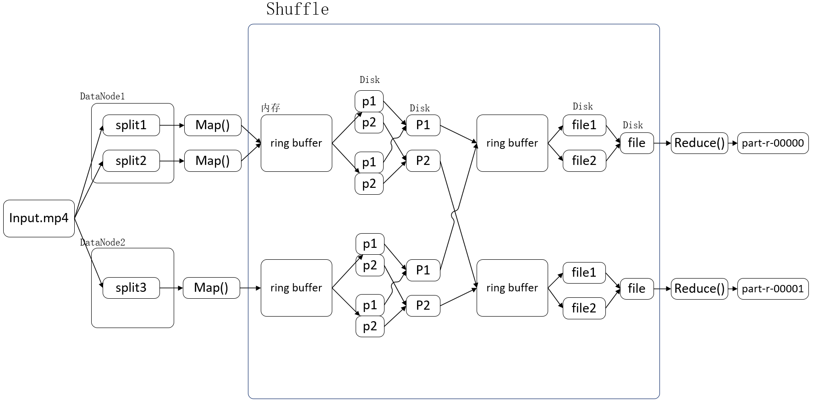

# MapReduce
1. Writable: hadoop自己开发的一套精简高效的序列化机制
    - Java自带的序列化是一个重量级序列化框架（Serializable），一个对象被序列化后，会附带很多额外的信息（各种校验信息，header，继承体系等），不便于在网络中高效传输。
1. HDFS分块(block)和MapReduce切片(split)
    - 分块：指的是文件在HDFS上的存储，将要存储的数据分成一块又一块，然后放在HDFS上存储；(2.7.3开始从64Mb变成了128Mb)
    - 切片：指的是MapReduce阶段的FileInputFormat阶段对于数据块的切片，默认的切片大小是块大小。
    - 三个文件的大小分别是:64KB 129MB 127MB，分块4块，切片3片
1. job提交流程源码过程
    1. job.waitForCompletion(true)
        - submit()
            - connect(),建立连接
            - submitter.submitJobInternal(Job.this, cluster),提交job
                - JobSubmissionFiles.getStagingDir(cluster, conf);创建给集群提交数据的Stag路径
                - submitClient.getNewJobID();获取jobid ，并创建job路径
                - copyAndConfigureFiles(job, submitJobDir);拷贝jar包到集群
                - writeSplits(job, submitJobDir);计算切片，生成切片规划文件
                    - writeNewSplits(job, jobSubmitDir);
                        - input.getSplits(job);
                - writeConf(conf, submitJobFile);向Stag路径写xml配置文件
                    - conf.writeXml(out);
                - submitClient.submitJob(
                             jobId, submitJobDir.toString(), job.getCredentials());提交job，返回提交状态
        - 向StagingDir下上传了
            - .staging/jobId/job.xml
            - .staging/jobId/job.split
            - .staging/jobId/job.jar
            
1. FileInputFormat源码解析(input.getSplits(job))
    ```
    //minSize参数调的比blockSize大，则可以让切片变得比blocksize还大。
    long minSize = Math.max(getFormatMinSplitSize(), getMinSplitSize(job));
    //maxSize参数如果调得比blocksize小，则会让切片变小，而且就等于配置的这个参数的值。
    long maxSize = getMaxSplitSize(job);
    ```
    
    ```
    long blockSize = file.getBlockSize();
    long splitSize = computeSplitSize(blockSize, minSize, maxSize);获取分片大小
    
    Math.max(minSize, Math.min(maxSize, blockSize));
    ```

    ```
       while (((double) bytesRemaining)/splitSize > SPLIT_SLOP){
            SPLIT_SLOP = 1.1
            当剩余的大小大于分片大小的1.1倍，继续分，否则不再分
       }

    ```
    - 最后将切片信息写入切片规划文件中（job.split？）
    - 数据切片只是在逻辑上对输入数据进行分片，并不会再磁盘上将其切分成分片进行存储。
    - InputSplit只记录了分片的元数据信息，比如起始位置、长度以及所在的节点列表等。
    - 提交切片规划文件到yarn上，yarn上的MrAppMaster就可以根据切片规划文件计算开启maptask个数。

1. CombineTextInputFormat切片机制
    - 在HDFS上存在大量小文件是，默认的分片机制会产生大量的切片，导致开启大量的maptask；为了避免这种情况，使用CombineTextInputFormat进行切片
    - 它的切片逻辑跟TextFileInputFormat不同：它可以将多个小文件从逻辑上规划到一个切片中，这样，多个小文件就可以交给一个maptask。
    - 优先满足最小切片大小，不超过最大切片大小
    ```
    job.setInputFormatClass(CombineTextInputFormat.class);
    CombineTextInputFormat.setMaxInputSplitSize(job, 4194304);// 4m
    CombineTextInputFormat.setMinInputSplitSize(job, 2097152);// 2m
    举例：0.5m+1m+0.3m+5m=2m + 4.8m=2m + 4m + 0.8m
    ```

1. partition分区
    - 默认partition分区：key的hashCode对reduceTasks个数取模
    ```
    public int getPartition(K key, V value, int numReduceTasks) {
        return (key.hashCode() & Integer.MAX_VALUE) % numReduceTasks;
      }

    ```
    - reduceTask的数量> getPartition的结果数，则会多产生几个空的输出文件part-r-000xx
    - 1<reduceTask的数量<getPartition的结果数，则有一部分分区数据无处安放，会Exception：java.io.IOException: Illegal partition for 13726230503 (3)
    - reduceTask的数量=1，则不管mapTask端输出多少个分区文件，最终结果都交给这一个reduceTask，最终也就只会产生一个结果文件 part-r-00000
    
1. 排序WritableComparable
    - Map Task和Reduce Task均会对数据按照key（这里的key是maptask输出的key）进行排序。
    - ring buffer的sort应该是快排，小文件合成大文件应该是归并
    - 自定义类需集成WritableComparable，重写compareTo()才可以作为key排序

1. 排序WritableComparator
    - GroupingComparator，reduce端的比较key的方法
    - 重写compare(WritableComparable a, WritableComparable b)，再加上无参构造调用父类有参构造

1. shuffle
    - ring buffer默认大小为100Mb，阈值为80%，可以调整。
    - 

1. Combiner合并（可以理解成只接收单机数据的Reducer）
    - combiner是MR程序中Mapper和Reducer之外的一种组件
    - combiner组件的父类就是Reducer
    - combiner和reducer的区别在于运行的位置：
        - Combiner是在每一个maptask所在的节点运行
        - Reducer是接收全局所有Mapper的输出结果；
    - combiner的意义就是对每一个maptask的输出进行局部汇总，以减小网络传输量

1. Join
    - 在reduce端的join效率低下，一张大表（动态的），一张小表（固定的映射），可以考虑利用distributedCache在map进行join
    - map端的join，集群运行时，计算节点将把缓存文件下载到linux本地，在本地读取数据
    ```
    //缓存小文件，本地测试路径写法：file:/C：/...，且需要以管理员权限运行idea才可以，否则无法创建小文件的链接
    job.addCacheFile(new URI("file:/C:/Users/SirAlex/Desktop/cache/pd.txt"));

    //map端join的逻辑不需要reduce阶段，设置reducetask数量为0
    job.setNumReduceTasks(0);
    ```

1. 自定义InputFormat类
    - 目的:读取某个文件时返回的K,V为自定义的封装对象
    - 步骤
        1. 自定义class继承FileInputFormat，重写createRecordReader()
        2. 自定义class继承RecordReader，重写initialize，nextKeyValue等方法
        3. mapper,reducer类
        4. driver类中的setInputFormatClass设置
        
1. 自定义OutputFormat类
    - 目的，自定义写出
    - 步骤
        1. 自定义class继承FileOutputFormat，重写getRecordWriter()
        2. 自定义class继承RecordWriter，重写write等方法
        3. mapper,reducer类
        4. driver类中的setOutputFormatClass设置

1. 计数器counter的使用
    ```
    context.getCounter(String groupName, String counterName).increment(1)
    ```
    
1. 数据压缩
    - 磁盘IO和网络带宽是Hadoop的宝贵资源，数据压缩对于节省资源、最小化磁盘IO和网络传输非常有帮助。
    - 运算密集型的job，少用压缩；IO密集型的job，多用压缩
    - 为了支持多种压缩/解压缩算法，Hadoop引入了编码/解码器，如Snappy，gZip
    ```
    //开启reduce输出压缩，并设置压缩格式
    FileOutputFormat.setCompressOutput(job, true);
    FileOutputFormat.setOutputCompressorClass(job, SnappyCodec.class);

    job.getConfiguration().set(FileOutputFormat.COMPRESS, "true");
    job.getConfiguration().set(FileOutputFormat.COMPRESS_CODEC, GzipCodec.class.getName());

    conf.set(FileOutputFormat.COMPRESS, "true");
    conf.set(FileOutputFormat.COMPRESS_CODEC, GzipCodec.class.getName());
    
    //设置map输出压缩
    conf.set(MRJobConfig.MAP_OUTPUT_COMPRESS, "true");
    conf.set(MRJobConfig.MAP_OUTPUT_COMPRESS_CODEC, SnappyCodec.class.getName());
    ```

1. 命令行参数传递
    - -Dname=value 用来给配置参数传值
    - -D 要放在其他参数的前面，如 -Dmapreduce.job.reduces=10 /tmp/input/word.txt /tmp/output
    - 如果job.set和-D参数冲突了，job.set 会覆盖掉-D参数设置。以job.set为主

1. mapreducer可以优化的地方
    - 块的大小和文件的数量这个就决定map任务的数量
    - 增加map buff缓冲区的大小（mapreduce.task.io.sort.mb）
    - map输出的KEY的设计均匀（9w 的a, a_序列或a_随机数）
    - 增加reduce的个数
    - 增加reduce copy buff缓冲区的大小，增加copy线程的线程数
    - 减少reduce阶段的数据输入量，在map阶段进行combiner、map输出时进行数据压缩

1. 几个典型的案例
    - 全局最大值最小值...
        