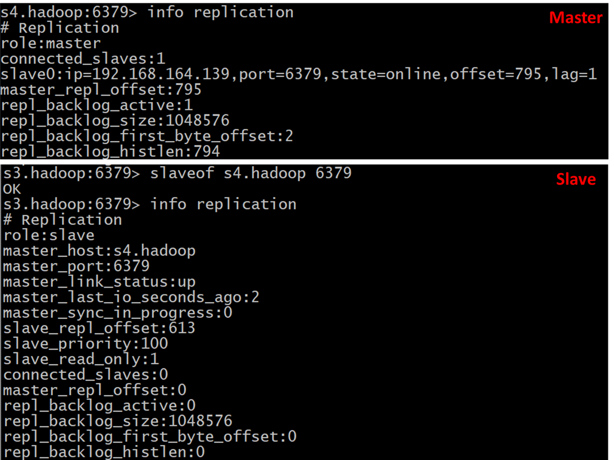

# Redis

1. NoSQL数据库分类  
    KV键值，文档型数据库（bson为主）,列存数据库，图关系数据库

1. RDBMS的ACID  
    Atomicity,Consistency,Isolation,Durability

1. 数据库的CAP理论  
    Consistency（强一致性）, Availability（高可用）, Partition tolerance(分区容错性)  
    传统数据库选择CA, 大多数网站架构AP, Redis、MongoDB是CP

1. Redis VS MemChache
    - 存储方式: memecache 把数据全部存在内存之中，断电后会挂掉，数据不能超过内存大小。redis有部份存在硬盘上，这样能保证数据的持久性，支持数据的持久化
    - 数据支持类型: redis在数据支持上要比memecache更加丰富
    - M(多线程+锁)，R(单线程，多路IO复用)

1. Redis常用数据类型
	- Key
	- String
	- List
	- Set
	- Hash
	- Zset

1. Redis的持久化
	- RDB(Redis DataBase)  
		在指定的时间间隔内将内存中的数据集快照写入磁盘，也就是行话讲的Snapshot快照，它恢复时是将快照文件直接读到内存里
		- 优势
			- 适合大规模的数据恢复
			- 对数据完整性和一致性要求不高
		- 劣势
			- 在一定间隔时间做一次备份，所以如果redis意外down掉的话，就会丢失最后一次快照后的所有修改
			- Fork的时候，内存中的数据被克隆了一份，大致2倍的膨胀性需要考虑
	- AOF(Append Only File)  
		以日志的形式来记录每个写操作，将Redis执行过的所有写指令记录下来(读操作不记录)
		- 当保存的appendonly.aof文件过大（默认64Mb，实际可以设计5G左右），Redis就会启动AOF文件的内容压缩，只保留可以恢复数据的最小指令集
		- 优势
			- 每修改同步：appendfsync always   同步持久化 每次发生数据变更会被立即记录到磁盘  性能较差但数据完整性比较好
			- （默认）每秒同步：appendfsync everysec    异步操作，每秒记录   如果一秒内宕机，有数据丢失
			- 不同步：appendfsync no   从不同步
		- 劣势
			- 相同数据集的数据而言aof文件要远大于rdb文件，恢复速度慢于rdb
			- Aof运行效率要慢于rdb,每秒同步策略效率较好，不同步效率和rdb相同
		- 注意：生成的dump.rdb文件会在启动redis server对应的目录下
	- 启动Redis server时，会加载持久化在硬盘上的数据，优先通过AOF进行恢复

- Redis事务
	- 命令
		- 开启事务：MULTI
		- 执行事务：EXEC
		- 放弃事务：DISCARD
		- 监控加锁：WATCH, 类似乐观锁。 监视一个或者多个key,如果在事务执行前监视的key被其他命令修改，那么事务会被打断，执行失败
		- 解除监控：UNWATCH, 取消监控点所有key
	- 错误执行时的情况
		1. 全部回滚，所有命令在入队（QUEUED）后都不执行（显式的命令错误，在入队时就会报错，如错误命令got, sat...）
		1. 跳过错误命令，执行者其他正确的命令（弱一致性，在入队时不报错，如给String自增操作）
	- 执行流程:开启，入队，执行

- Redis的发布订阅(即较弱的MQ功能，不常用)
	- 进程间的一种消息通信模式：发送者(pub)发送消息，订阅者(sub)接收消息。
	- SUBSCRIBE, PUBLISH, PSUBSCRIBE

- 主从复制
	- 即主从复制，主机数据更新后根据配置和策略，自动同步到备机的master/slaver机制，Master以写为主，Slave以读为主
	- 常用模式
        - 一主多从
            
            - SLAVEOF 主机IP 主机Redis端口号，也可在配置文件直接配置主从关系
            - info replication：查看主从信息
            - 主机宕机，从机仍然保留主机数据，在默认设置下回原地待命，不会立刻升级成master；主机重新上线，仍然是主机。
            - 从机宕机，重启后不再是slave，除非重新设置slaveof
        - 薪火相传
            - 上一个Slave可以是下一个slave的Master，Slave同样可以接收其他slaves的连接和同步请求，那么该slave作为了链条中下一个的master,可以有效减轻master的写压力
        - 反从为主
            - 手动使当前数据库停止与其他数据库的同步，转成主数据库
            - 命令：SLAVEOF no one
        - 哨兵模式
            - 即反客为主的自动版，能够后台监控主机是否故障，如果故障了根据投票数自动将从库转换为主库
            - 步骤
                1. 新建sentinel.conf文件，配置被监控数据库名字
                1. 启动哨兵
                1. 主机下线，从机经过头片自动产生新的master
                1. 原来的主机回来后，会自动成为slave
            - 一组sentinel能同时监控多个Master
                
    - 复制原理
        1. Slave启动成功连接到master后会发送一个sync命令
        1. Master接到命令启动后台的存盘进程，同时收集所有接收到的用于修改数据集命令，
           在后台进程执行完毕之后，master将传送整个数据文件到slave,以完成一次完全同步
        1. 全量复制：而slave服务在接收到数据库文件数据后，将其存盘并加载到内存中。
        1. 增量复制：Master继续将新的所有收集到的修改命令依次传给slave,完成同步
        1. 但是只要是重新连接master,一次完全同步（全量复制)将被自动执行
        1. 缺点
            - 由于所有的写操作都是先在Master上操作，然后同步更新到Slave上，所以从Master同步到Slave机器有一定的延迟，
            当系统很繁忙的时候，延迟问题会更加严重，Slave机器数量的增加也会使这个问题更加严重。
        
- Redis集群
    - Slot
        - Redis 集群有16384个哈希槽,每个key通过CRC16校验后对16384取模来决定放置哪个槽.
        - 不在一个slot的键值，不能使用mget和mset等多键操作
        - 可以通过{}定义组，使得多个键分配到同一个slot中去
    - [一致性哈希算法原理](https://www.cnblogs.com/lpfuture/p/5796398.html)
    - [实例解读什么是Redis缓存穿透、缓存雪崩和缓存击穿](https://baijiahao.baidu.com/s?id=1619572269435584821&wfr=spider&for=pc)

- Redis的Java客户端Jedis
    - 常用API
    - JedisPool
        
- [Redis常用命令](http://redisdoc.com/)