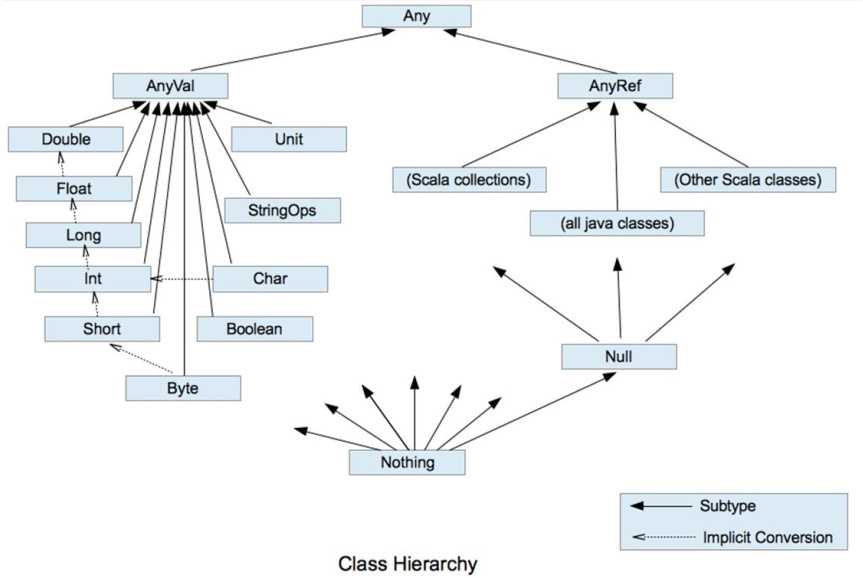
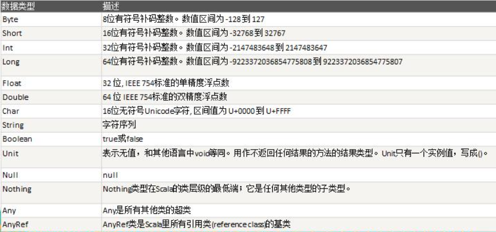

# Scala基础
- HelloWorld
```scala
/**
* scala程序的执行流程
* 1. object经过scalac编译后生成两个类Hello,Hello$
* 2. Hello中的main()调用Hello$中的一个静态对象MODULE$
* 3. Hello$.MODULE$是静态的，通过该对象调用Hello$的main()
* 4. 即在Hello的main()中代码放在了Hello$的main()，
*/

/**
* public final class Hello
  {
    public static void main(String[] paramArrayOfString)
    {
      Hello$.MODULE$.main(paramArrayOfString);
    }
  }
*/

/**
* public final class Hello$
  {
    public static final  MODULE$;
  
    static
    {
      new ();
    }
  
    public void main(String[] args)
    {
      Predef..MODULE$.println("hello world");
    }
    private Hello$() { MODULE$ = this; }
  
  }
*/
// 看到object Hello即可以理解为它是class Hello$的静态单例对象MODULE$
object Hello {
  def main(args: Array[String]): Unit = {
    println("hello world")
  }
}
```

- 变量类型(声明：var/val 变量名[:变量类型]=变量值)
    - 声明变量时，类型可省略（编译器自动推导，即类型推导）。小数默认为Double，整数位Int
    - Scala是强数据类型语言：类型确定后，无法更改
    - var修饰可变，val不可变
        - 一般编程中，我们获取对象后对属性进行修改，而不是对象本身，此时这个对象可以用val修饰
        - 因为val没有线程安全问题，因此效率高，Scala设计者推荐使用val
        - 若对象需改变，则使用var修饰
        - val修饰变量在编译后，等同于加上了final
        - var修饰的对象引用可变，val则不可以，但是其对象的状态（值）是可变的
        - 声明变量时，需要初始值

- 数据类型
    - 
    -      
    - 类型转换： var ans = 10*3.5.toInt + 6*1.5.toInt
        
- 基本语法
    - a to b <=> [a,b]
    - a until b <=> [a,b)
    - for(item <- arr){}
    - for(i<- 1 to 10; j <- 1 to 10) <=> for(i<- 1 to 10){for(j <- 1 to 10)}
    - for(i <- Range(start, end, step):for(i <- Range(1,10,2))(注意范围：[start,end))
    - Scala内置控制结构去掉了break,continue,是为了更好的适应函数式编程，推荐使用函数风格去实现，而不是关键字
        - breakable{...break()}
        - 循环守卫代替continue：for(i <- 1 to 10 if(i!=2)){print(i)}
    
- 特殊关键字
 - yield
 ```scala
    val res = for(i<- 1 to 10 if i%2==0) yield i
//    res = Vector(2, 4, 6, 8, 10)
 ```
 - “_”的用法
    - var name:String = _（相当于null），var age:Int = _（相当于0）。指定变量类型，系统分配默认值
    - 通配符，相当于java的*, import scala.collection.mutable._
    - import java.util.{HashMap=>_,_}，引入java.util下的所有类，除了HashMap
 
- Java vs Scala
|Java|Scala|
|-|-|
|变量类型 变量名|变量名:变量类型|
|分号结尾|不需分号|
|声明变量时，可不需要初始值|声明变量时，需要初始值|
|基本+引用数据类型|都是对象|
|八大基本数据类型|八大基本数据类型+Unit+StringOps|
|++，--|+=1，-=1|
|int a = 10>1?1:0|var a = if(10>1) 1 else 0|
|switch|match case|
|for(int i = 0; i<10; i++)|for(i <- 1 to 10)|
|break, continue|breakable(),循环守卫|
|懒加载|惰性函数|
|编译异常+运行异常|运行异常|
|数组索引中括号|数组索引小括号****|