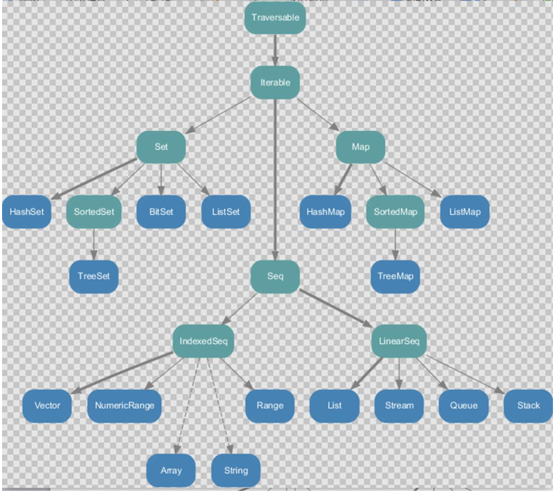
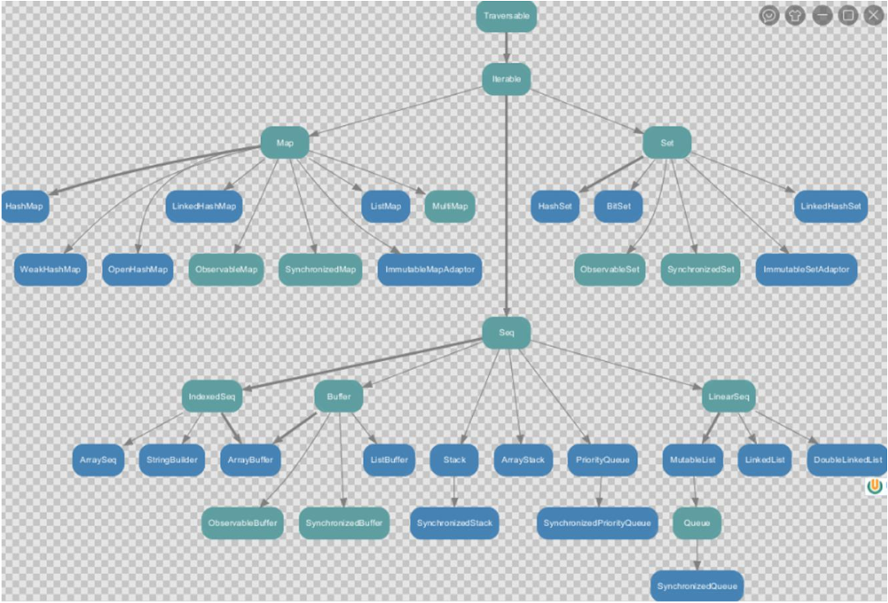

# scala数据结构

- 

- 

- 数组
    - 初始化数组
        - ```scala
          // 默认值为0
          val arr = new Array[Int](10)//底层 int[] arr = new int[10]
          arr(1) = 7
          
          // 数组为泛型为Any,调用了object Array的apply方法
          var arr2 = Array(1,2,"test")
          ```
    - 遍历数组
        - ```scala
          for(i <- arr){
                println(i)
            }
          
          for(i<- 0 until arr.length){
              println(arr(i))
            }
          ```
    - 变长数组,类似java的ArrayList
        - ```scala
           import scala.collection.mutable.ArrayBuffer
           val arr = new ArrayBuffer[Int]()
           arr.append(7)
           arr(0) = 1
           arr.remove(0)
           
           //调用apply方法
           val arr2 = ArrayBuffer[Int]()
          ```
    - 转换
        - ```scala
          //定长转可变,返回一个可变数组，arr本身不变 
            arr.toBuffer
          // 可变转定长,返回一个定长数组，arr本身不变 
            arr.toArray
          ```
    - 多维数组
        - ```scala
            // int[][] arr = new int[3][4]
            var arr = Array.ofDim[Int](3,4)
  
          ```
     - scala数组与java的List相互转换
        ```scala
        import scala.collection.JavaConversions.bufferAsJavaList
        import scala.collection.JavaConversions.asScalaBuffer
        ```
        
- 元组（最多只能有22各元素）
    - ```scala
        val tup = (1,2,3,"test")//下标从**1**开始
        println(tup._1)
        println(tup.productElement(0))//下标从**0**开始
        
        for(i<-tup.productIterator){
            println(i)
          }
  
        ```
        
- List
    - 默认的List是scala.collection.immutable.List，不可变
    - 可变的需要用ListBuffer
    - ```scala
        val list0 = List(1,2,3) //创建时直接分配元素
        val list1 = Nil // 空集合
        print(list0(0)) //索引访问，从0开始
        
  
        // 运算规则从右向左
        // 运算时，集合对象放在最右边
        val list2 = list0:+4 //(1,2,3,4),list0不变
        val list3 = 10+:list0 //(10,1,2,3), list0不变
        val list4 = 5::6::7::list0::Nil //(5,6,7,1,2,3) // :: 表示向集合中添加单个元素
        val list5 = 5::6::7::list2:::list0:::Nil // :::是将集合中的所有元素加到集合中
        
      ```
    - ListBuffer
        - ```scala
            import scala.collection.mutable.ListBuffer
            val list1 = ListBuffer[Int](1,2,3)
            val list2 = ListBuffer[Int]
  
            list1+=4
            val list3 = list1 //引用传递！
            list1.append(5)
            list1 ++= list3 // ListBuffer(1, 2, 3, 4, 5, 1, 2, 3, 4, 5)
            list1.remove(0)
            ```
- Queue
    - ```scala
        import scala.collection.mutable
        val queue = new mutable.Queue[Int]()
        queue += 9
        queue ++=List(1,2,3)
        queue.dequeue()
        queue.enqueue(4,5,6,7)//Queue(1,2,3,4,5,6,7)
        
        println(queue.head)
        println(queue.tail)
        ```