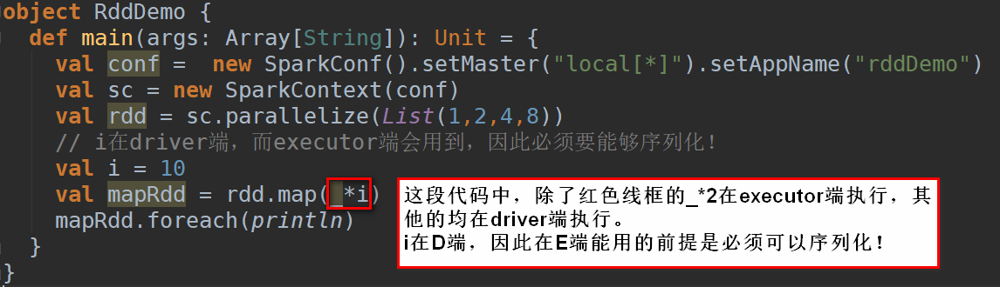
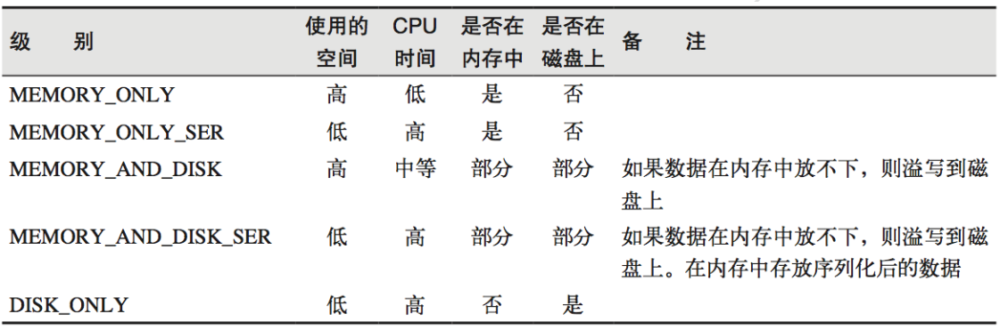

# Spark Core

1. Driver
    - 是执行开发程序中main方法的进程
    - 创建spark上下文对象的应用程序
    - [Spark学习之driver](https://blog.csdn.net/dpengwang/article/details/79058831)

1. Executor
    - 是一个工作进程，负责在spark作业中运行任务，任务间互相独立
    - 
    
1. RDD
    - RDD（Resilient Distributed Dataset）叫做弹性分布式数据集，是 Spark 中最基本的数据抽象，
        它代表一个**不可变**、**可分区**、**里面的元素可并行计算**的集合。
        - 分布式：数据来源，计算，结果数据存储
        - 数据集：RDD不存储数据，只存储计算逻辑，只有第一次在一个行动操作中用到时，才会真正根据计算逻辑计算。
        - RDD的弹性
            - 计算和存储：计算是基于内存的，性能高。同时可以自动进行内存和磁盘数据存储的切换
            - 血缘：基于血统的高效容错机制，同时也可以灵活切断血缘关系（checkpoint）
            - 容错
                - Task 如果失败会自动进行特定次数的重试（默认次数是 4 次）
                - Stage 如果失败会自动进行特定次数的重试（默认次数是 4 次）
                - Checkpoint 和 Persist 可主动或被动触发
            - 数据
                - 数据调度弹性
                - 数据分区的高度弹性，可以根据需要调整分区数量
                    - coalesce:缩减分区，无shuffle
                    - repartition<=>coalesce(numPartitions, shuffle = true),可增可减分区，有shuffle
                
    - RDD属性
        - 分区
        - 计算函数
        - 依赖（可无）
        - 分区器（可无）
        - 优先位置（即移动计算不移动数据。可无，如读取第三方介质，如MySQL）
        
    - 生成RDD
        - sc.parallelize(Array(1,2,3,4,5,6,7,8),numSlices)
            - numSlices：指定分区数
            - conf.getInt("spark.default.parallelism", math.max(totalCoreCount.get(), 2))
        - sc.textFile("HDFS:/User/...", minPartitions)
            - minPartitions（默认是2）：最小分区数，但是不一定是实际分区数，取决的Hadoop读取文件时的分片规则
            - 不指定minPartitions时，按照Hadoop的分片规则分区，即有几个块就有几个分区
        - 从其他RDD转换
            - 在没有主动改变分区数的前提下，RDD的分区数与其父RDD相等（参见源码）
    
    - RDD的特点
        - 分区
        - 只读
        - 依赖
            - 窄依赖：表现为一个父RDD的分区对应于一个子RDD的分区，或多个父RDD的分区对应于一个子RDD的分区
            - 宽依赖：（除了窄依赖，就是宽依赖）表现为存在父RDD的一个分区对应子RDD的多个分区
                - 由于有 Shuffle(落盘)的存在，只能在父RDD处理完成后，才能开始接下来的计算，因此宽依赖是划分Stage的依据。
            - 不要混淆transformation/action算子以及宽/窄依赖之间的关系!!
        - DAG
            - 根据宽依赖划分（反过来查看，遇到宽依赖就划分一个stage,因为宽依赖(shuffle)算的慢）
        - 缓存
            - cache <=> persist(StorageLevel.MEMORY_ONLY)
            - persist缓存级别(在存储级别的末尾加上“_2”表示把持久化数据存为两份)
            - 为了提速，减少复杂rdd的重算
            
        - checkpoint
            - 更加安全：将结果持久化到磁盘文件(HDFS)，然后删除持久化rdd之前的血缘关系！
            - 而cache存在缓存失效的问题，因此不会删除持久化rdd之前的血缘关系
    
    - 分区器
        - HashPartitioner
            - 对于给定的key，计算其hashCode，并除于分区的个数取余，如果余数小于 0，则用余数+分区的个数，最后返回的值就是这个key所属的分区 ID。
            - partitionID = key.hashCode%numPartitions + key.hashCode%numPartitions>0?:0:numPartitions;
            - 弊端：可能导致每个分区中数据量的不均匀，极端情况下会导致某些分区拥有 RDD 的全部数据。
        - RangePartitioner
            - 类似于HBase的预分region
            - 优势：尽量保证每个分区中数据量的均匀，而且分区与分区之间是有序的，一个分区中的元素肯定都是比另一个分区内的元素小或者大；
            - 弊端：对数据有限制要求：了解数据的范围
        - 自定义分区方式
            - 继承 org.apache.spark.Partitioner 类
                - numPartitions: Int:返回创建出来的分区数。
                - getPartition(key: Any): Int:返回给定键的分区编号(0 到 numPartitions-1)。
                - equals():Java 判断相等性的标准方法。
        - sortBy
            - 内部实现了一个RangePartitioner，因此多partition并行排序结果是**全局有序**的！
        - 注意
            - 只有Key-Value类型的RDD才有分区的，非Key-Value类型的RDD分区的值是None
            - 每个RDD的分区ID范围：0~numPartitions-1，决定这个值是属于那个分区的。
 
- Spark任务划分
    - Application: 初始化一个SparkContext即生成一个Application
    - Job: 一个Action算子就会生成一个Job
    - Stage: 根据RDD之间依赖关系的不同将Job划分成不同的Stage,遇到一个宽依赖就划分一个Stage
        - 总的stage数量=1(ResultStage，即整个Job作为1个阶段)+shuffle数量(宽依赖，ShuffleMapStage)
    - Task: Stage是一个TaskSet, task的数量对应RDD中的partition数量
    - Application->Job->Stage->Task没一层都是一对多的关系

- Spark任务执行
    - 输入可能以多个文件的形式存储在HDFS上，每个**File**都包含了多个**Block**
    - Spark读取这些文件作为输入时，会根据具体数据格式对应的InputFormat进行解析，一般是将若干个Block合并成一个输入分片，称为**InputSplit**，注意InputSplit不能跨越文件。
    - 随后将为这些输入分片生成具体的**Task**。InputSplit与Task是一一对应的关系。
    - 随后这些具体的Task每个都会被分配到集群上的某个节点的某个**Executor**去执行。
        - 每个节点可以起一个或多个Executor。
        - 每个Executor由若干core组成，每个Executor的每个core一次只能执行一个Task。
        - 每个Task执行的结果就是生成了目标RDD的一个partiton。

- Task与Executor数量关系
    - 如果task1,task2所需的数据都在executor1所在的节点，而因为开启的executor数量较多，executor1领到了task1，executor2领到了task2。
    虽然看起来e1,e2并行，但是考虑到数据网络传输，可能效率不增反减，不如让executor1完成task1后再计算task2。
    - 考虑到优先位置原则，Task的数量一般是Executor数量的**3-5**倍

- Spark三大数据结构
    - RDD: 分布式数据及
    - 累加器：分布式只写共享变量
    - 广播变量：分布式只读共享变量

- 累加器
    - 工作节点上的任务不能访问累加器的值。从这些任务的角度来看，累加器是一个只写变量。
    - ```
      val conf =  new SparkConf().setMaster("local[*]").setAppName("rddDemo")
      val sc = new SparkContext(conf)
      val rdd = sc.parallelize(List(1,2,3,4),2)
      var sum = 0
      // 在excutor端执行sum+i
      // 但是executor之间相互独立，因此不返回各自的累加sum值
      rdd.foreach(i => sum = sum+i)
      // 在driver无法接收excutor的累加值
      // 输出结果sum = 0
      println(sum)
  
      // 创建累加器
      val ac: LongAccumulator = sc.longAccumulator
      // 累加器强调其只写性，executor端执行完累加会返回driver端
      rdd.foreach(i=>ac.add(i))
      println(ac.value)
  
      sc.stop()
      ```
    - 自定义累加器
        ```
        object AccDemo {
          def main(args: Array[String]): Unit = {
            val conf: SparkConf = new SparkConf().setMaster("local[*]").setAppName("accDemo")
            val sc = new SparkContext(conf)
        
            val rdd: RDD[String] = sc.parallelize(List("hive","hbase","scala","spark","hadoop"))
            // 创建累加器
            val accumulator = new WordAccumulator
            // 注册累加器
            sc.register(accumulator)
            rdd.foreach(word => accumulator.add(word))
            println(accumulator.value)
        
            sc.stop()
          }
        }
        
        
        // String, util.ArrayList[String]分别是输入输出参数的泛型
        class WordAccumulator extends AccumulatorV2[String, util.ArrayList[String]]{
          private val list = new util.ArrayList[String]()
        
          // 是否初始化
          override def isZero: Boolean = list.isEmpty
        
          override def copy(): AccumulatorV2[String, util.ArrayList[String]] = new WordAccumulator
        
          override def reset(): Unit = list.clear()
        
          // 累加
          override def add(v: String): Unit = {
            if(v.contains("h")) list.add(v)
          }
        
          // 多executor的累加器合并
          override def merge(other: AccumulatorV2[String, util.ArrayList[String]]): Unit = list.addAll(other.value)
        
          // 返回的结果
          override def value: util.ArrayList[String] = list
        }
        ```

- 广播变量
    - ```
        val conf =  new SparkConf().setMaster("local[*]").setAppName("rddDemo")
        val sc = new SparkContext(conf)
        val map: Map[Int, String] = Map((1,"A"),(2,"B"),(3,"C"),(4,"D"))
        val broadCastMap: Broadcast[Map[Int, String]] = sc.broadcast(map)
        val rdd = sc.parallelize(List(1,2,3,4),2)
    
        val mapRDD: RDD[String] = rdd.map(i=>{
          // 每个task都需要传输一个map到executor
          // 如果一个map100M,1个executor上要执行4个task
          // 需要占用executor400M内存，网络传输400M
           map(i)
    
          // 一个executor共享一个map
          // 需要占用executor100M内存，网络传输100M
          val value: Map[Int, String] = broadCastMap.value
          value(i)
        })
    
        mapRDD.foreach(println)
    
        sc.stop()
      ```
    - 变量只会被发到各个节点一次，应作为只读值处理(修改这个值不会影响到别的节点)。
    - 广播变量需实现序列化
