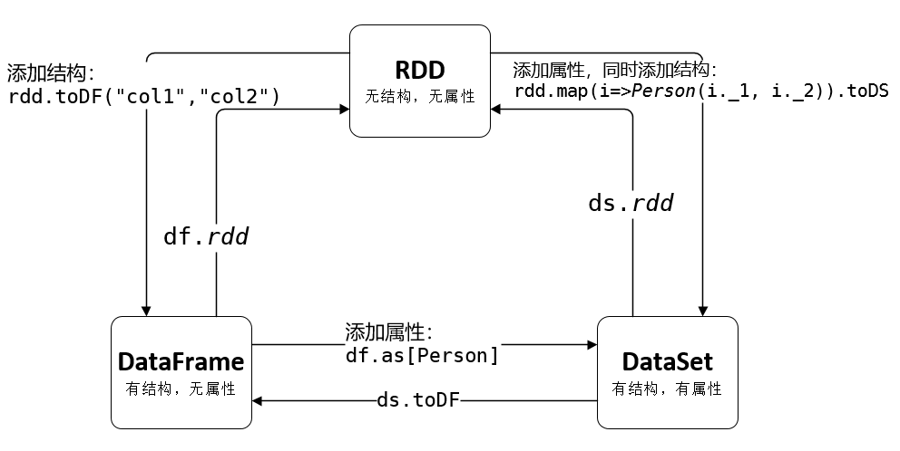

#Spark SQL

- RDD, DataFrame, DataSet
    - RDD
        - 优势：RDD的最大好处就是简单，API的人性化程度很高
        - 劣势：性能限制。RDD它是一个JVM驻内存对象，这也就决定了存在GC的限制和数据增加时Java序列化成本的升高。
    - DataFrame
        - DataFrame更像传统数据库的二维表格(按照表的方式访问，即“字段”而非“属性”，因此顺序需要能对得上)，除了数据以外，还记录数据的**结构信息**，即schema。
        - DataFrame每一行的类型固定为**Row**(DataFrame也可以叫Dataset\[Row])，只有通过解析才能获取各个字段的值
        - df2.foreach(row => println(row.getString(0),row.getInt(1)))
        - 优势：性能高于RDD
            - 定制化内存管理：数据以二进制的方式存在于非堆内存，节省了大量空间之外，还摆脱了GC的限制。
            - 优化的执行计划：查询计划通过Spark catalyst optimiser进行优化.
        - 劣势：在编译期缺少类型安全检查，导致运行时出错
    - DataSet
        - DataSet是具有强类型的数据集合，需要提供对应的类型信息
        - 每一行数据是一个对象(ds: Dataset\[Person])，即一行数据不光有结构，也有类型，每一列的数据可以通过dataset.属性访问
        - ds2.foreach(person => println(person.age, person.name))
    - 

- 自定义函数
    - UDF
    - UDAF
    
- Spark SQL数据源
    - Hive
        - 内嵌Hive：直接用即可。（类似于HBase内嵌的Zookeeper，一般不使用）
        - 外部Hive：将外部Hive中的hive-site.xml拷贝或者软连接到Spark安装目录下的conf目录下
    - JDBC
        - 读写数据库