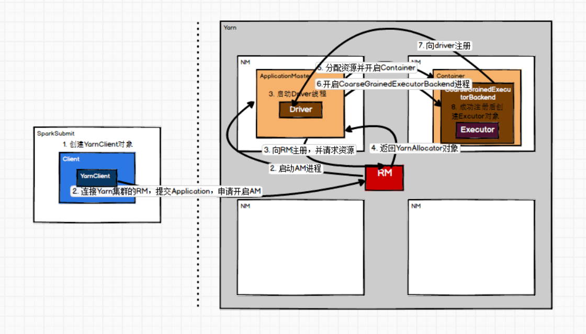

# Spark任务Yarn部署流程

spark-submit \
--class org.apache.spark.examples.SparkPi \
--master yarn \
--executor-memory 1G \
--total-executor-cores 2 \
/usr/local/spark/examples/jars/spark-examples_2.11-2.1.1.jar \
100



1. SparkSubmit
    1. main //启动进程
        1. appArgs = new SparkSubmitArguments(args) //封装命令行参数
        1. submit(appArgs)
            1. val (childArgs, childClasspath, sysProps, childMainClass) = prepareSubmitEnvironment(args)// 准备提交环境
                - client模式：childMainClass = args.mainClass //即直接在提交任务的机器上启动driver
                - cluster模式：childMainClass = "org.apache.spark.deploy.yarn.Client" // 在Yarn集群的AM上启动driver
            1. doRunMain
                1. runMain(childArgs, childClasspath, sysProps, childMainClass, args.verbose)
                    1. mainClass = Utils.classForName(childMainClass)//反射加载类
                    1. val mainMethod = mainClass.getMethod("main", new Array[String](0).getClass)//获取main方法
                    1. mainMethod.invoke(null, childArgs.toArray)//调用childMainClass的main方法
                        1. main // 调用org.apache.spark.deploy.yarn.Client的main方法
                            1. val args = new ClientArguments(argStrings) // 封装命令行参数
                            1. new Client(args, sparkConf)
                                - val yarnClient = YarnClient.createYarnClient
                            1. client.run()
                                - this.appId = submitApplication()
                                    - 创建启动AM的contexts
                                        - ```
                                            // 封装指令，创建启动AM容器的contexts, 
                                            - val containerContext = createContainerLaunchContext(newAppResponse)
                                                ClusterMode
                                                command：/bin/java org.apache.spark.deploy.yarn.ApplicationMaster ...
                                                Client Mode
                                                command：/bin/java org.apache.spark.deploy.yarn.ExecutorLauncher ...
                                            // 创建提交AM的contexts
                                            - val appContext = createApplicationSubmissionContext(newApp, containerContext)
                                          ```
                                    - yarnClient.submitApplication(appContext) //向Yarn RM提交app,提交指令

1. org.apache.spark.deploy.yarn.ApplicationMaster
    1. main // 启动进程
        - val amArgs = new ApplicationMasterArguments(args) // 封装命令行参数
        - master = new ApplicationMaster(amArgs, new YarnRMClient)// 创建AM对象，传参YarnRMClient用于与RM通信
        - master.run()
            - runDriver(securityMgr)
                - userClassThread = startUserApplication() // 启动用户应用
                    - val mainMethod = userClassLoader.loadClass(args.userClass).getMethod("main", classOf[Array[String]])
                    - new Thread.start() // 启动Driver线程，运行用户app的main方法
                        - override def run()：mainMethod.invoke(null, userArgs.toArray)
                        - userThread.setName("Driver")
                - registerAM(sc.getConf, rpcEnv, driverRef, sc.ui.map(_.appUIAddress).getOrElse(""),securityMgr) //向RM注册AM
                    - allocator = client.register(driverUrl,
                            driverRef,
                            yarnConf,
                            _sparkConf,
                            uiAddress,
                            historyAddress,
                            securityMgr,
                            localResources) // AM向RM注册
                    - allocator.allocateResources() // 分配资源
                        - handleAllocatedContainers(allocatedContainers.asScala) //按照数据本地化策略配置容器
                            - runAllocatedContainers(containersToUse) // 根据配置在NM中开启容器，在容器内运行Executors
                                - new ExecutorRunnable().run()
                                    - nmClient = NMClient.createNMClient()  
                                    - nmClient.init(conf)  
                                    - nmClient.start()  
                                    - startContainer()  
                                        - val commands = prepareCommand() //封装命令
                                        /bin/java "org.apache.spark.executor.CoarseGrainedExecutorBackend" ...

1. org.apache.spark.executor.CoarseGrainedExecutorBackend
    1. main //开启进程
        1. run
            1. val env = SparkEnv.createExecutorEnv // 创建executor的sparkEnv
            1. new CoarseGrainedExecutorBackend(env.rpcEnv, driverUrl, executorId, hostname, cores, userClassPath, env)
                1. onStart()
                    1. ref.ask\[Boolean](RegisterExecutor()) //executor向driver注册,二者NettyRpc通信
                1. receive() 
                    1. case RegisteredExecutor => executor = new Executor(executorId, hostname, env,
                     userClassPath, isLocal = false) //注册完毕，创建CoarseGrainedExecutorBackend类中的executor对象！
                    1. executor.launchTask() // executor开启任务
            1. env.rpcEnv.awaitTermination() // Wait until [[RpcEnv]] exits.
               